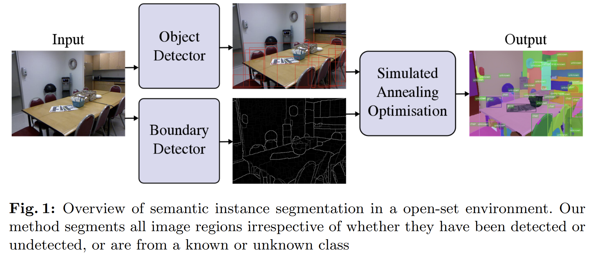

# Bayesian Semantic Instance Segmentation in Open Set World

### Demo
In this demo, we use images from coco mini val dataset. We have already pre-computed object detections, ucms and (hierarchical) region features
- Run setup.m
- Run demo.m

### Test on new images.
- Create a new folder under datasets, and save images under datasets/abc/images (Follow the structure of ms_coco_samples for reference.).
- Run COB network https://github.com/kmaninis/COB on these images to get ucms, and save them under ucms folder.
- Run an object detector network to generate bounding box detections, and save them under detections folder.
- Run compute_tree_and_feautures.m to compute region hierarchies and features.
- Update demo.m script with the new path to your dataset, and then run demo.m.

### Citation:
If you use this code, please consider citing the following papers:

    @Inproceedings{Pham2018,
       author = {{Pham}, et. al.},
        title = "{Bayesian Semantic Instance Segmentation in Open Set World}",
        booktitle={ECCV}, 
        year={2018}, 
    }
	
If you encounter any problems with the code, please contact the first author at trungptt at gmail dot com. Enjoy!